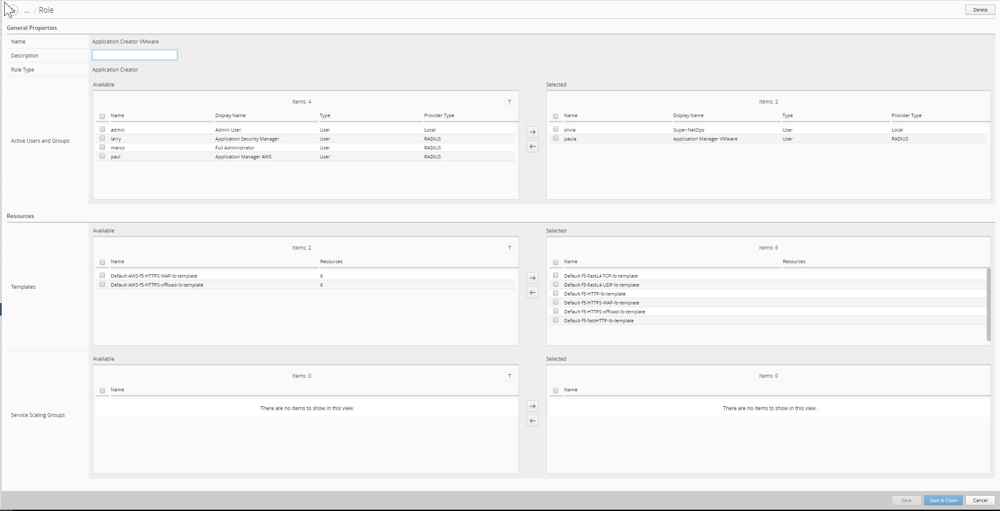

Lab 1: Adding BIG-IQ DCD
------------------------

Log in to the BIG-IQ Console Node (10.1.1.4 admin/admin)

- Under System => BIG-IQ DATA COLLECTION
- Select BIG-IQ Data Collection Devices
- Click the Add button

.. image:: ../pictures/module1/img_module1_lab1_1.png
  :align: center
  :scale: 50%

- Add the DCD Management IP Address (10.1.1.13), Username admin, Password admin, and the Data Collection IP Address (self-IP: 10.1.10.13). Data collection port default is 9300. Click the Add button in the lower right of the screen.

.. image:: ../pictures/module1/img_module1_lab1_2.png
  :align: center
  :scale: 50%

- Adding the DCD will take a minute or two:

.. image:: ../pictures/module1/img_module1_lab1_3.png
  :align: center
  :scale: 50%

- DCD item in UI displayed.

-- Status – State indicator: Green(UP)|Yellow(Unhealthy)|Red(Down)
-- Device name – Hostname of DCD (data collection device)
-- IP Address – IP Address of interface used for data collection.
-- Version – Software version of BIG-IQ DCD (data collection device)

- Add Services to the new DCD Device by clicking the Add Services link under the services column

-- Activate the Access, FPS, and Web Application Security stats. Make sure the Service Status is Active (each click may take a minute to register)

- *Auth Provider* = Radius
- *User Name* = marco
- *Full Name* = Full Administrator
- (*Password stored in Radius server* = marco)
- *Role* = Administrator Role

**2. Larry: Application Security Manager**

- *Auth Provider* = Radius
- *User Name* = larry
- *Full Name* = Security Manager
- (*Password stored in Radius server* = larry)
- *Role* = Security Manager

**3. Paula: Application Manager VMware**

- *Auth Provider* = Radius
- *User Name* = paula
- *Full Name* = Application Manager
- (*Password stored in Radius server* = paula)
- *Role* = Application Creator VMware (custom role with ALL default templates except AWS)

**4. Paul: Application Manager AWS**

- *Auth Provider* = Radius
- *User Name* = paul
- *Full Name* = Application Manager
- (*Password stored in Radius server* = paul)
- *Role* = Application Creator AWS (custom role with AWS default templates only)

**5. David: Super-NetOps**

Click on *Add*

- *Auth Provider* = local
- *User Name* = david
- *Full Name* = Super-NetOps
- *Password* = david
- *Role* = Application Creator VMware (custom role with ALL default templates)

Click on *Save & Close*`

.. warning:: Only local users are supported to execute Ansible playbook

.. image:: ../pictures/module1/img_module1_lab2_1.png
  :align: center
  :scale: 50%

Application Creator VMware custom role:

