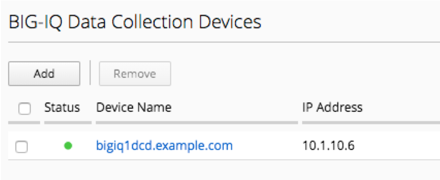
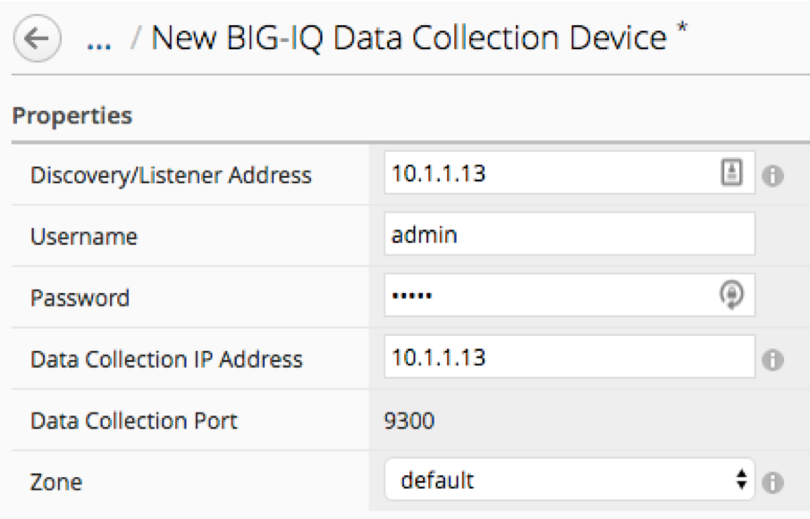
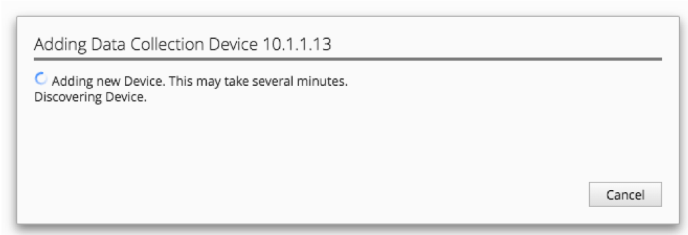
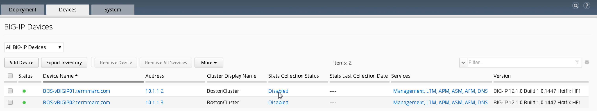
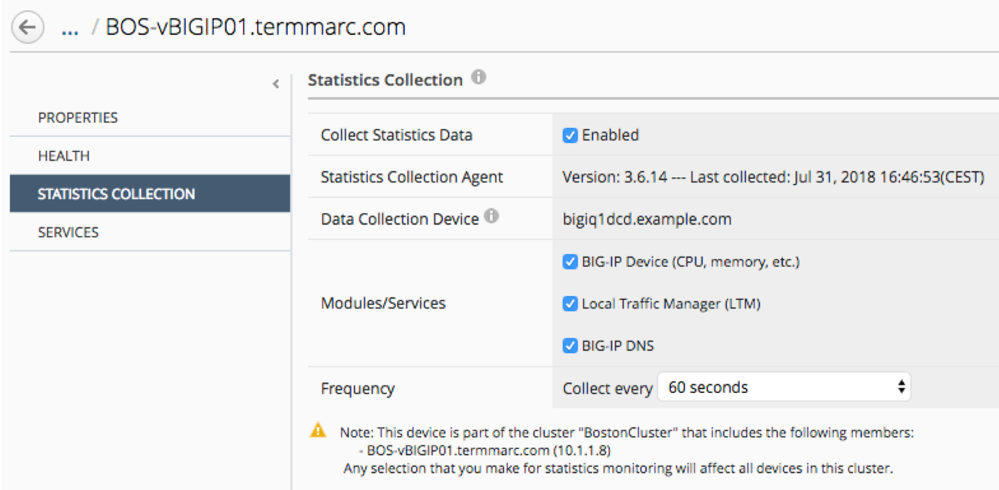
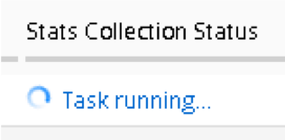

Lab 1: Adding BIG-IQ DCD
------------------------

Log in to the BIG-IQ Console Node (10.1.1.4 admin/admin)

- Under System => BIG-IQ DATA COLLECTION
- Select BIG-IQ Data Collection Devices
- Click the Add button

- Add the DCD Management IP Address (10.1.1.13), Username admin, Password admin, and the Data Collection IP Address (self-IP: 10.1.10.13). Data collection port default is 9300. Click the Add button in the lower right of the screen.

- Adding the DCD will take a minute or two:

- DCD item in UI displayed:

- Status - State indicator: Green(UP)|Yellow(Unhealthy)|Red(Down)
- Device name – Hostname of DCD (data collection device)
- IP Address – IP Address of interface used for data collection
- Version – Software version of BIG-IQ DCD (data collection device)
- Add Services to the new DCD Device by clicking the Add Services link under the services column
- Activate the Access, FPS, and Web Application Security stats. Make sure the Service Status is Active (each click may take a minute to register)

*Turn on statistics collection for existing devices*

For devices that were discovered before you added the DCD, you can now enable the statistics collection for those devices.
Click on the Devices tab and click on the “Disabled” link under Stats Collection Status for **ip-10-1-1-7.us- west-2.compute.internal**

.. note:: Make sure the device is showing green in the status column before adding stats

Click the Enabled button, accept the defaults, and click the Save & Close button in the lower right.

The Stats Collection Status field will go to “Task running...” while the statistics collection iApp is being installed on the target device.

We will come back later to check out the new statistics capabilities.
