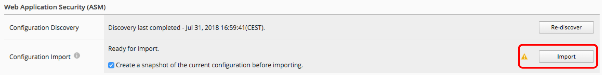

Lab 2.1: Import BIG-IP
----------------------

Adding a BIG-IP device to the BIG-IQ system inventory is the first step to management. First, we will be adding the secondary member device of cluster BOS to be managed in BIG-IQ.

1. Log in to the BIG-IQ system with the username (admin) and password (admin)
2. On the top menu bar, select **Devices** from the BIG-IQ menu
3. On the left-hand menu bar, click **BIG-IP Devices**
4. Click the **Add Device** button in the main pane

- In the **IP Address** (10.1.1.10) field, type the IPv4 or IPv6 address of the device.
- In the **User Name** and **Password** fields, type the user name (admin) and password (admin) for the device
- Cluster Display Name: Select **Use Existing** and choose **BostonCluster** in the list

|

5. Click the **Add** button to add this device to BIG-IQ

6. BIG-IQ now exchanges certs with the BIG-IP and pops up a window for the administrator to select which modules to manage from BIG-IQ. For this device, select all services except Fraud Protection Services. Leave the Statistics monitoring boxes all checked, and then click the Continue button

.. image:: ../pictures/module2/img_module2_lab1_2.png
  :align: center
  :scale: 50%

|

7. The discovery process will start and you should see a screen like the following. At this point, BIG-IQ is using REST calls to the BIG-IP to pull the selected parts of the BIG-IP configuration into BIG- IQ

|

Allow the import jobs to complete. At this point, the configuration of the BIG-IP that have been imported are not yet editable in BIG-IQ. To make the configurations editable in BIG-IQ, we need to **"Complete import tasks"**

8. On the Device Inventory screen, click the **Complete import tasks** link in the Services column for *BOS-vBIGIP02* (you may need to scroll right to see the services column)

|

9. In the Local Traffic (LTM) section, select the check box for *“Create a snapshot of the current configuration before importing”* and click the *Import* button

.. image:: ../pictures/module2/img_module2_lab1_5.png
  :align: center
  :scale: 50%

|

10. Once LTM import is done, you can proceed with the Access (APM) section, select the check box for *“Create a snapshot of the current configuration before importing”* and click the *Import* button.

|

- BIG-IQ Access has its own notion of device grouping called “Access Groups” where you define a “Source Device” where configuration changes can be made and deployed to the other devices in the Access Group. Use existing Access Group by choosing **Existing** from the drop-down and select "BostonAG", then click the **Add** button to continue

|

11. In the Web Application Security (ASM) section, select the check box for *“Create a snapshot of the current configuration before importing”* and click the *Import* button

|

- In step 11, you will experience “Conflict Resolution.” A conflict is when an object that is already in the BIG-IQ working config has the same name, but different contents as an object that exists on the BIG-IP that is being imported. The user must select whether to keep the object from BIG-IP or BIG-IQ configuration. Storage will be updated accordingly. Review the differences that have been discovered as part of this import by clicking on each row in the difference view

|

- In this lab, we are going to choose to keep the version of the object that is already in the BIG-IQ. Click the *Continue* button
- A window reminds us that these conflict resolution selections will not modify the configuration that is running on this BIG-IP until we deploy changes from BIG-IQ. Click the *Resolve* button to continue

|

12. In the Network Security (AFM) section, select the check box for *“Create a snapshot of the current configuration before importing”* and click the *Import* button

|

13. In the BIG-IP DNS section, click the *Import* button

|

14. Click the back arrow button at the top of the section to return to the inventory

.. image:: ../pictures/module2/img_module2_lab1_13.png
  :align: center
  :scale: 50%

|

15. Click on the BOS-vBIGIP02.termmarc.com device link to review the device Properties, Health, and Services information for the device

|

16. Click through the Properties, Health, Statistics Collection, and Services tabs to review the information

17. Click the arrow in the upper left of the Services panel to return to the device inventory screen

|

18. Click the Export Inventory button in the main pane to review the contents of the device inventory CSV file

19. The CSV file is automatically downloaded to your client. Launch the CSV file from your downloads folder. For example, in Chrome the CSV file will appear in the lower left

20. Review the contents of the file and understand all of the information that is provided.

|

You have just added a new device to be managed centrally from BIG-IQ and imported all configuration from selected services/modules.
You are now ready to create, modify and delete objects/properties of your BIG-IP devices from BIG-IQ without a need to connect locally on BIG-IP.
