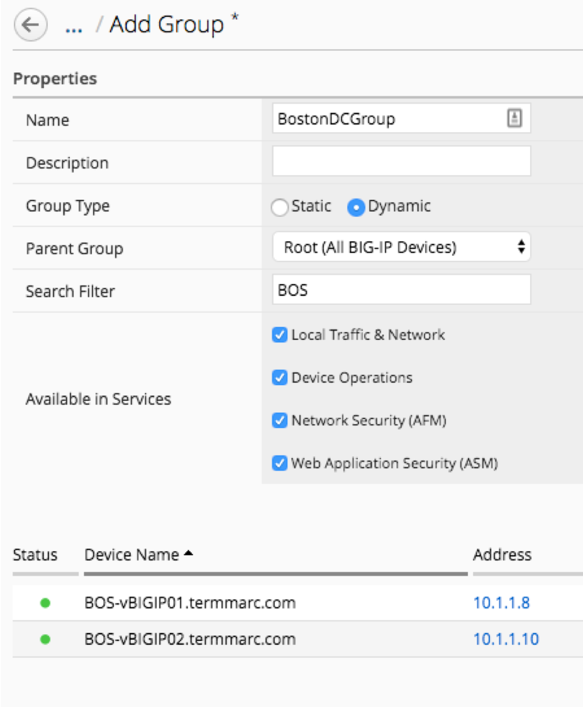
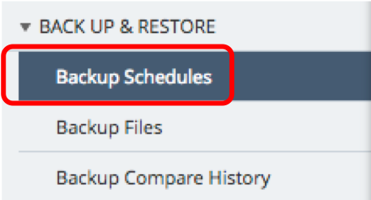
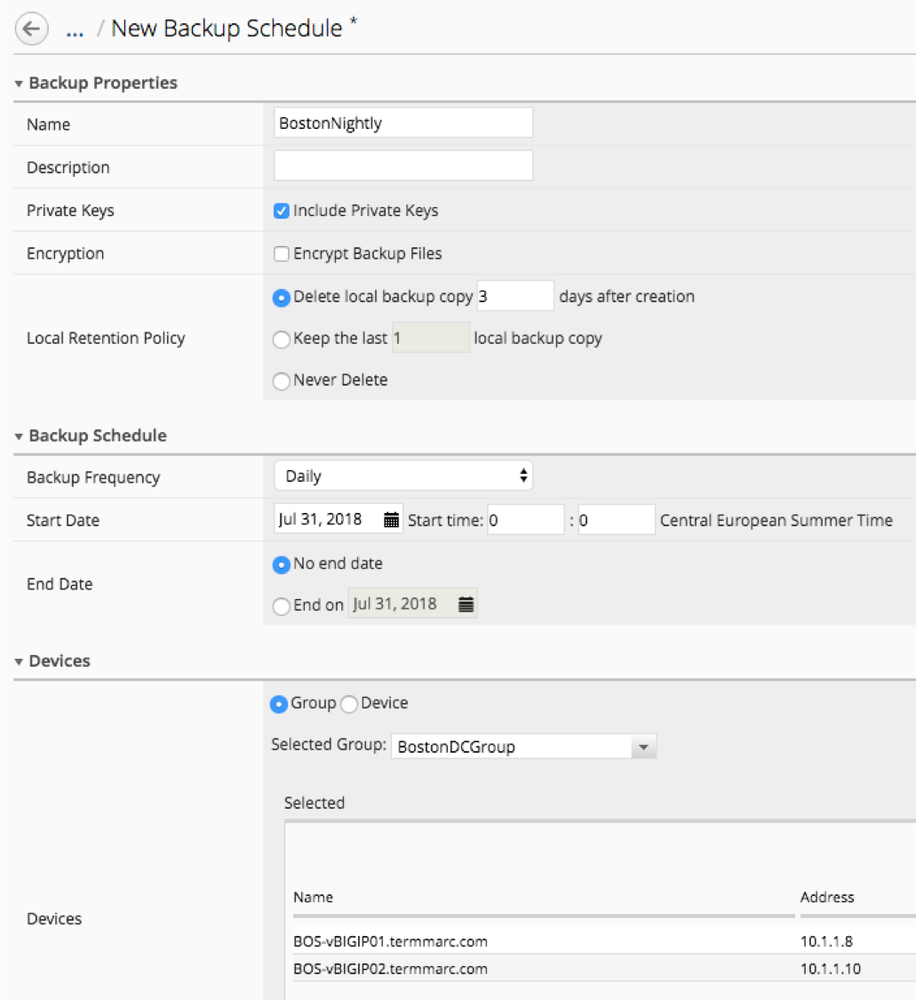
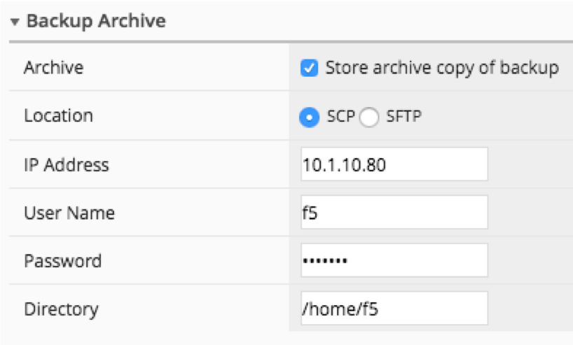

Lab 2.2: Automating device backup and archiving a copy of the backup file
-------------------------------------------------------------------------

BIG-IQ provides the ability to backup individual or groups of managed devices on an ad-hoc or a scheduled basis. The admin can decide how long to retain the backups on BIG-IQ and has the option of archiving a copy of the UCS backup off to an external device for DR or deeper storage purposes.
In this scenario, we are going to schedule a nightly backup that archives a copy off to our archive for DR purposes.

First, we need to create the group for our backup schedule to reference. We have two options in BIG-IQ:

- static groups: where devices are added and removed manually,
- dynamic groups: where devices are selected from a source group based on filter criteria

In this lab setup, the devices have BOS in the name to indicate that they are in the Boston datacenter. This makes the dynamic group the logical choice.

1. On the top menu bar, select *Devices* from the BIG-IQ menu

2. Click *Device Groups* in the left-hand menu

3. Click *Create* in the main pane

4. Complete the settings to create the group.

- Name: **BostonDCGroup**
- Group Type: **Dynamic**
- Parent Group: **Root (All BIG-IP Devices)**
- Search Filter: **BOS**

5. Click on the **Back Up & Restore** and **Backup Schedules** on the left-hand menu

6. Click the **Create** button in the main pane

7. Fill out the Backup Schedule

- Name: BostonNightly
- Local Retention Policy: Delete local backup copy 3 days after creation
- Backup Frequency: Daily
- Start Time 00:00 Central European Summer Time
- Under Devices, select the Groups radio button
- Select from the drop-down list the **BostonDCGroup**
- Archive: Store Archive Copy of Backup
- Location: SCP
- IP Address: 10.1.10.80
- User name: f5
- Password: default
- Directory: /home/f5

5. Click **Save & Close** to save the scheduled backup job.
