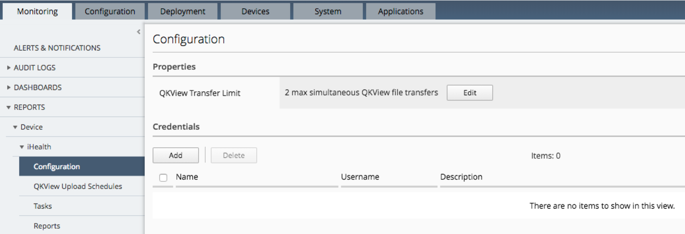
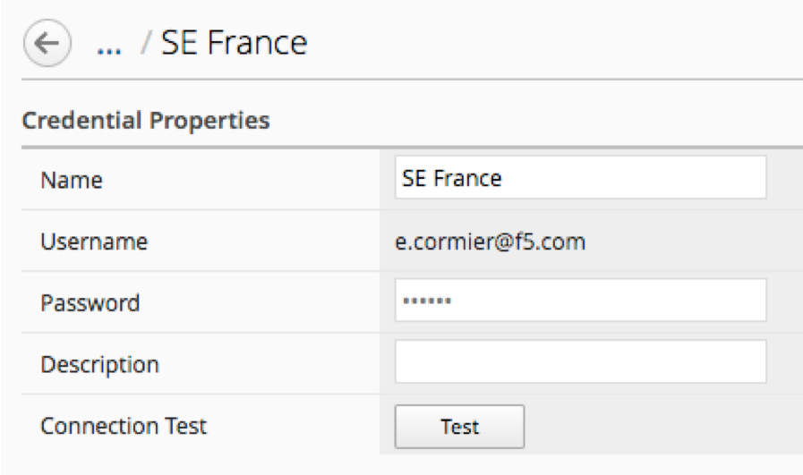
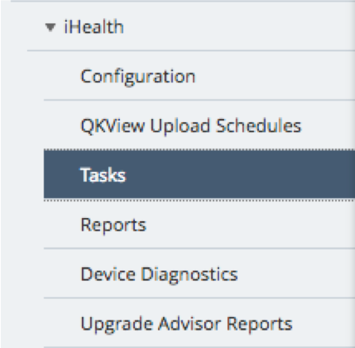
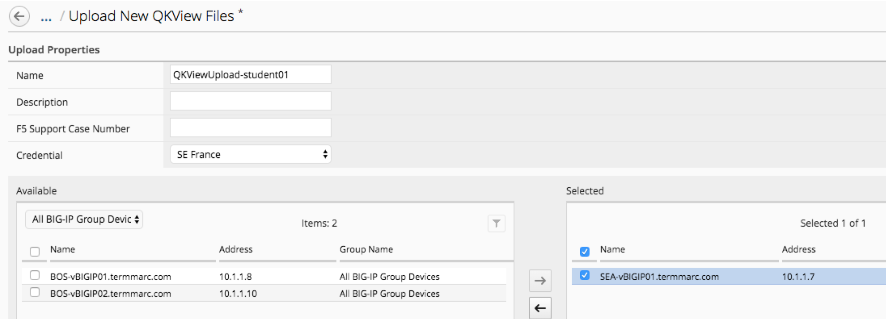
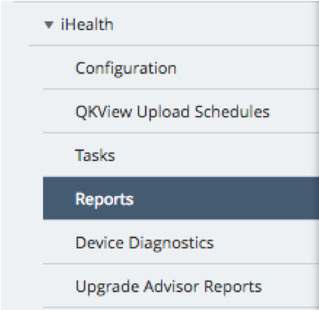
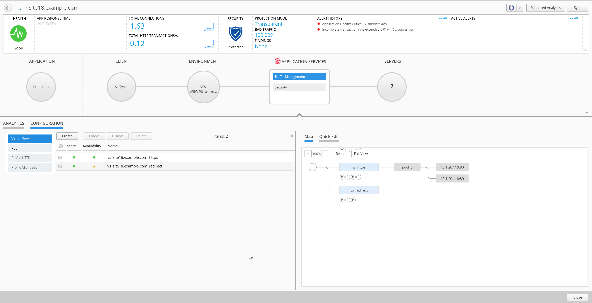
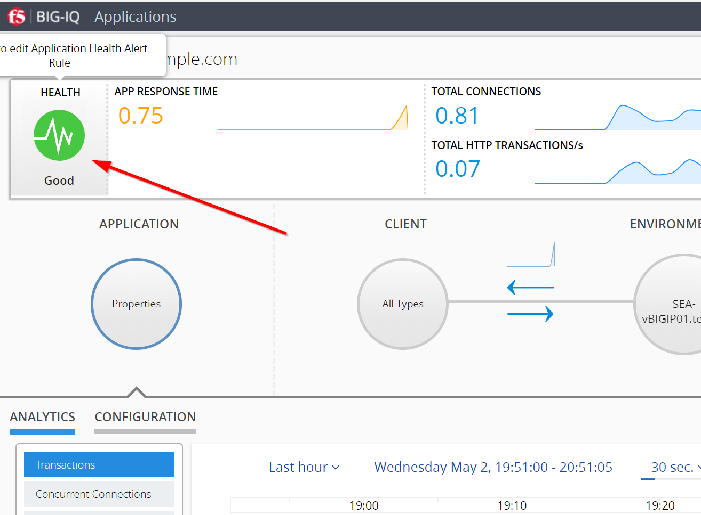

Lab 2.3: Upload QKView to iHealth for a support case
----------------------------------------------------

BIG-IQ can now push qkviews from managed devices to ihealth.f5.com and provide a report of heuristic hits based on the qkview. These qkview uploads can be performed ad-hoc or as part of a F5 support case. If a support case is specified in the upload job, the qkview(s) will automatically be associated/linked to the support case.

1. Navigate to Monitoring on the top menu bar and then to *REPORTS-> Device-> iHealth -> Configuration* on the left-hand menu

2. Add Credentials to be used for the qkview upload and report retrieval. Click the Add button under Credentials

- Servers (Pool Member): ``10.1.20.118`` and ``10.1.20.119``

3. Fill in the credentials that you used to access https://ihealth.f5.com:

- Name: Give the credentials a name to be referenced in BIG-IQ
- Username: <Username you use to access iHealth.f5.com>
- Password: <Password you use to access iHealth.f5.com>

4. Click the Test button to validate that your credentials work

5. Click the Save & Close button in the lower right

6. Click the Tasks button in the BIG-IQ iHealth menu

 7. Click the QKView Upload button to select which devices we need to upload QkViews from

8. Fill in the fields to upload the QkViews to iHealth

- Name: QKViewUpload5346 (append the last 4 digits of your cell number to make this request unique)
- Credentials: <Select the credentials you just stored in step 3>
- Devices: Select ip-10-1-1-7.us-west-2.compute.internal

9. Click the Save & Close button in the lower right. The task will be started immediately

.. note: You can also schedule QKview uploads on a regular basis using the QKView Upload Schedules on the left menu ba

10. Click on the name of you upload job to get more details

.. image:: ../pictures/module2/img_module2_lab3_8.png
  :align: center
  :scale: 50%

11. Observe the progress of the Qkview creation, retrieval, upload, processing, and reporting. This operation can take some time, so you may want to move on to the next exercise and come back

12. Once a job reaches the Finished status, click on the Reports menu to review the report

.. image:: ../pictures/module2/img_module2_lab3_9.png
  :align: center
  :scale: 50%

13. You can also run the Upgrade Advisor from the BIG-IQ if you are running an older version of code. Select Upgrade Advisor Reports from the left-hand menu bar and then click the Create button in the main window pane

14. Give your Upgrade Advisor Task a name and select the ip-10-1-1-7 device. Choose your Target Version and then Save & Close

15. Click on the Upgrade Advisor Reports on the left-hand menu bar and your new report should show up shortly. You can see the status of the report generation by clicking Tasks on the left-hand menu-bar. Click on the Target Software Version column to view your results
