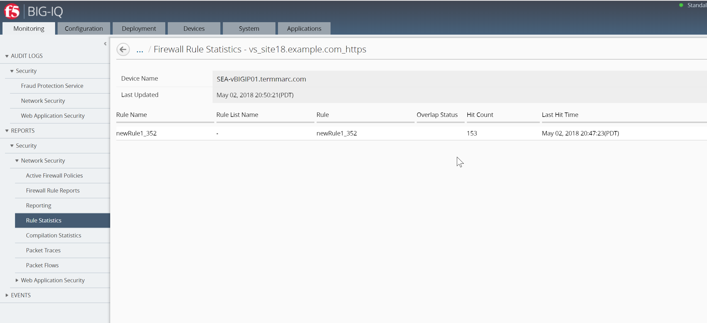
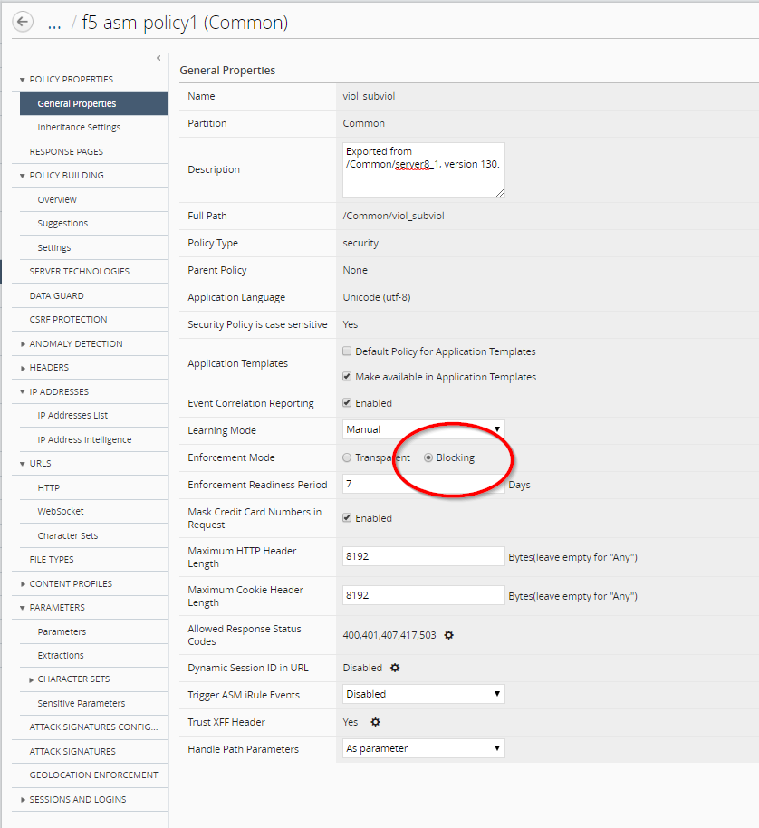
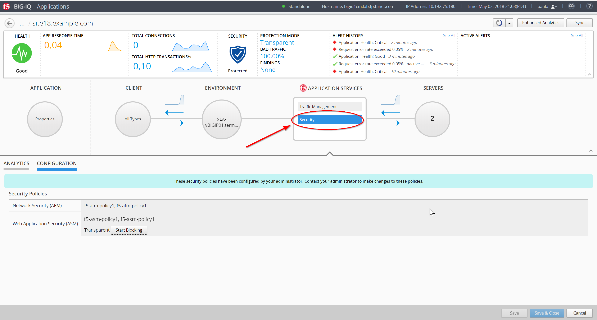
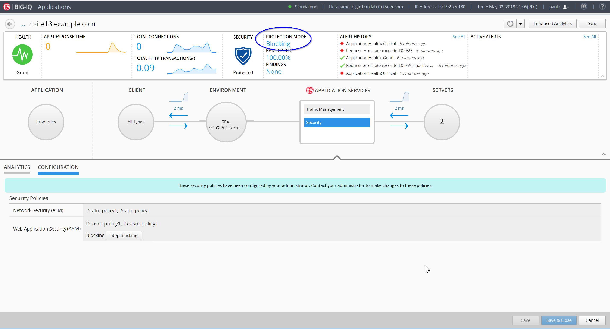

Lab 2.4: ADC/LTM Management Workflow
------------------------------------

BIG-IQ is able to create nodes, monitors, pools, profiles, and virtual servers, so a user can create and stage a new application direct on the BIG-IQ. BIG-IQ can create some monitors and profiles on BIG-IQ and can associate other profiles and monitors that already exist on the managed BIG-IP.

1. Navigate to the Configuration tab on the top menu bar

2. We will build our application starting at the nodes and making our way to the virtual servers. Navigate to **LOCAL TRAFFIC > Nodes**

3. Click the Create button to create a node

.. image:: ../pictures/module2/img_module2_lab4_3.png
  :align: center
  :scale: 50%

4. Fill out the configuration properties for the node

- Name: MyAppNode1
- Device: SEA-vBIGIP01.termmarc.com
- Address: 10.1.10.110

5. Click the Save & Close button in the lower right

6. Repeat steps 4 and 5 for the second node

- Name: MyAppNode2
- Device: SEA-vBIGIP01.termmarc.com
- Address: 10.1.10.111

7. Verify that the MyApp nodes are created by typing MyApp in the filter box in the upper right and pressing return

8. You should now see an entry for each of the MyApp nodes on SEA-BIG-IP01.

.. note:: When you create an object on a clustered device, BIG-IQ automatically replicates that configuration to the peer node in the staged configuration.

9. Now we will create a pool with these nodes as pool members. Navigate to **LOCAL TRAFFIC > Pools**

10. Click the Create button to start creating your pool

.. image:: ../pictures/module2/img_module2_lab4_7.png
  :align: center
  :scale: 50%

11. Fill out the Pool Properties

- Name: MyAppPool
- Device: SEA-vBIGIP01.termmarc.com
- Health Monitors: /Common/tcp
- Load Balancing Method: Round Robin

.. image:: ../pictures/module2/img_module2_lab4_8.png
  :align: center
  :scale: 50%

12. Click the Save & Close button in the lower right

13. Click on the MyAppPool name in the list of pools to add pool members

.. image:: ../pictures/module2/img_module2_lab4_9.png
  :align: center
  :scale: 50%

14. Click on the New Member button under Resources to add pool members

.. image:: ../pictures/module2/img_module2_lab4_10.png
  :align: center
  :scale: 50%

15. Complete the Pool Member Properties for the first pool member

- Node Type: Existing Node
- Node: MyAppNode1
- Port: 80

.. image:: ../pictures/module2/img_module2_lab4_11.png
  :align: center
  :scale: 50%

16. Click the Save button in the lower right to save the pool member

17. Repeat steps 15 and 16 for the second pool member

18. Click the Save & Close button in the lower right to save your pool

19. Now we will create a custom profile for our Virtual Server. Navigate to **LOCAL TRAFFIC > Profiles**

.. image:: ../pictures/module2/img_module2_lab4_12.png
  :align: center
  :scale: 50%

20. Click the Create button to create our custom profile

.. image:: ../pictures/module2/img_module2_lab4_13.png
  :align: center
  :scale: 50%

21. Fill out the Profile Properties

- Name: Source_Addr_Timeout_75
- Type: Persistence Source Address Affinity
- Parent Profile: Source_addr
- Timeout: Specify 75 Seconds

.. image:: ../pictures/module2/img_module2_lab4_14.png
  :align: center
  :scale: 50%

22. Click Save & Close in the lower right

23. Now we will create our Virtual Server. Navigate to **LOCAL TRAFFIC > Virtual Servers**

.. image:: ../pictures/module2/img_module2_lab4_15.png
  :align: center
  :scale: 50%

24. Click the Create button to create the Virtual Server

.. image:: ../pictures/module2/img_module2_lab4_16.png
  :align: center
  :scale: 50%

25. Fill out the Virtual Server Properties

- Name: MyAppVS
- Device: SEA-vBIGIP01.termmarc.com
- Destination Address: 10.1.10.200
- Service Port 8088

.. image:: ../pictures/module2/img_module2_lab4_17.png
  :align: center
  :scale: 50%

26. Scroll down and fill out the Resources

- Default Pool: MyAppPool
- Default Persistence Profile: Source_Addr_Timeout_75

Leave all other options at their default settings

.. image:: ../pictures/module2/img_module2_lab4_18.png
  :align: center
  :scale: 50%

27. Click Save & Close in the lower right

28. We now have staged our application and we will deploy it in a later workflow
