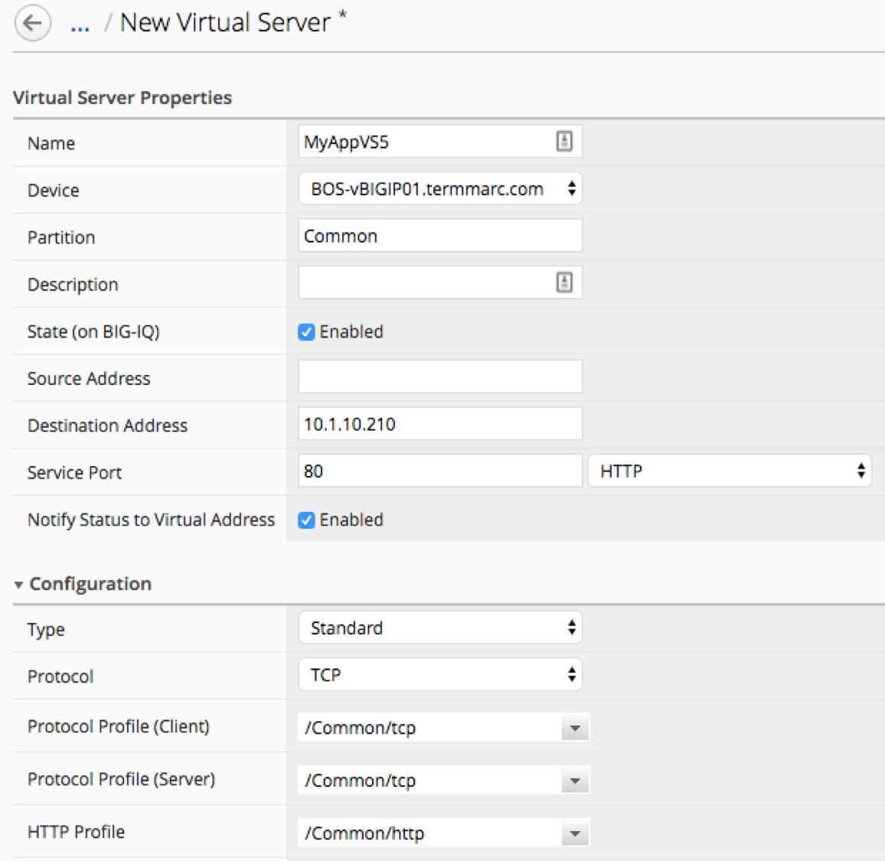

Lab 3.1: ADC/LTM Management Workflow
------------------------------------

BIG-IQ is able to create nodes, monitors, pools, profiles, and virtual servers, so a user can create and stage a new application directly on the BIG-IQ. BIG-IQ can create some monitors and profiles on BIG-IQ and can associate other profiles and monitors that already exist on the managed BIG-IP.

1. Navigate to the Configuration tab on the top menu bar

2. We will build our application starting at the nodes and making our way to the virtual servers. Navigate to **LOCAL TRAFFIC > Nodes**

.. image:: ../pictures/module3/img_module3_lab1_1.png
  :align: center
  :scale: 50%

|

3. Click the *Create* button to create a node

4. Fill out the configuration properties for the node

- Name: *MyAppNode5*
- Device: *BOS-vBIGIP01.termmarc.com*
- Address: *10.1.20.130*

.. image:: ../pictures/module3/img_module3_lab1_2.png
  :align: center
  :scale: 50%

|

5. Click the *Save & Close* button in the lower right

6. Repeat steps 4 and 5 for the second node

- Name: *MyAppNode6*
- Device: *BOS-vBIGIP01.termmarc.com*
- Address: *10.1.20.131*

7. Verify that the MyApp nodes are created by typing MyApp in the filter box in the upper right and pressing return

- You should now see an entry for each of the MyApp nodes on both BOS BIG-IPs.

.. image:: ../pictures/module3/img_module3_lab1_3.png
  :align: center
  :scale: 50%

|

.. note:: When you create an object on a clustered device, BIG-IQ automatically replicates that configuration to the peer node in the staged configuration.

8. Now we will create a pool with these nodes as pool members. Navigate to **LOCAL TRAFFIC > Pools**

|

9. Click the *Create* button to start creating your pool

10. Fill out the Pool Properties

- Name: *MyAppPool5*
- Device: *BOS-vBIGIP01.termmarc.com*
- Health Monitors: */Common/tcp*
- Load Balancing Method: *Round Robin*

.. image:: ../pictures/module3/img_module3_lab1_5.png
  :align: center
  :scale: 50%

|

11. Click the *Save & Close* button in the lower right

12. Click on the *MyAppPool5* name in the list of pools to add pool members

13. Click on the *New Member* button under Resources to add pool members

14. Complete the Pool Member Properties for the first pool member

- Node Type: *Existing Node*
- Node: *MyAppNode5*
- Port: *80 - HTTP*

.. image:: ../pictures/module3/img_module3_lab1_6.png
  :align: center
  :scale: 50%

15. Click the Save button in the lower right to save the pool member

16. Repeat steps 13 through 15 for the second pool member

17. Click the Save & Close button in the lower right to save your pool

18. Now we will create a custom profile for our Virtual Server. Navigate to **LOCAL TRAFFIC > Profiles**

.. image:: ../pictures/module3/img_module3_lab1_7.png
  :align: center
  :scale: 50%

|

19. Click the *Create* button to create our custom profile

20. Fill out the Profile Properties

- Name: *Source_Addr_Timeout_75*
- Type: *Persistence Source Address*
- Parent Profile: *source_addr*
- Timeout: *Specify 75 seconds*

.. image:: ../pictures/module3/img_module3_lab1_8.png
  :align: center
  :scale: 50%

|

21. Click *Save & Close* in the lower right

22. Now we will create our Virtual Server. Navigate to **LOCAL TRAFFIC > Virtual Servers**

.. image:: ../pictures/module3/img_module3_lab1_9.png
  :align: center
  :scale: 50%

|

23. Click the *Create* button to create the Virtual Server

24. Fill out the Virtual Server Properties

- Name: *MyAppVS5*
- Device: *BOS-vBIGIP01.termmarc.com*
- Destination Address: *10.1.10.210*
- Service Port *80 - HTTP*
- HTTP Profile: *http*

|

25. Scroll down and fill out the Resources

- Default Pool: *MyAppPool5*
- Default Persistence Profile: *Source_Addr_Timeout_75*

|

26. Click *Save & Close* in the lower right

27. We now have staged our application, no changes have been sent yet to BIG-IP. We will deploy it in a later workflow and assign later an AWAF/ASM policy on the same virtual server.
