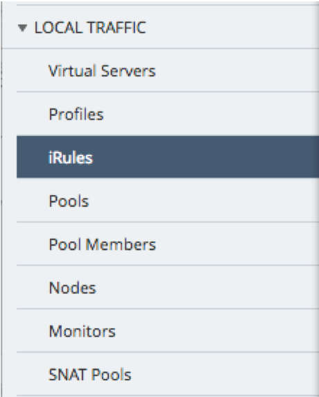
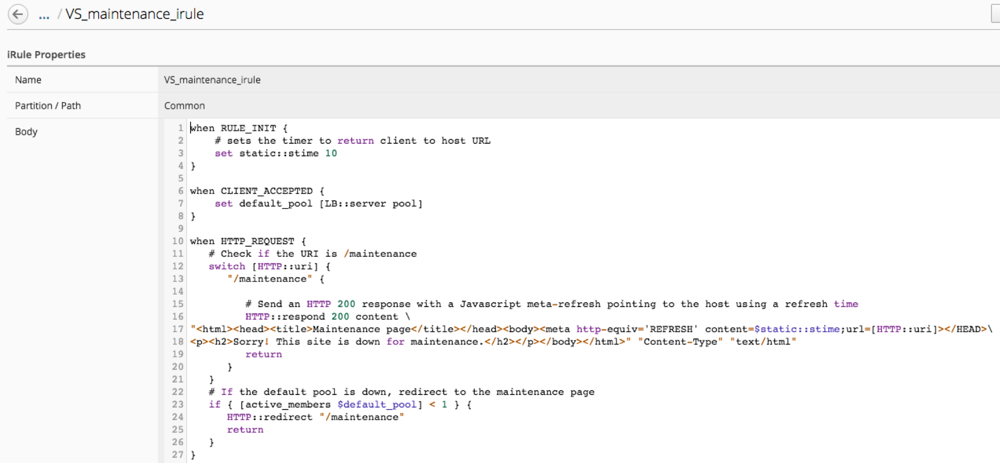
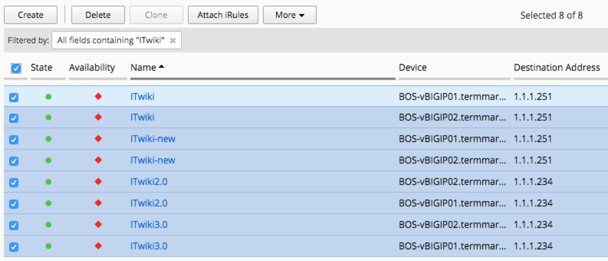
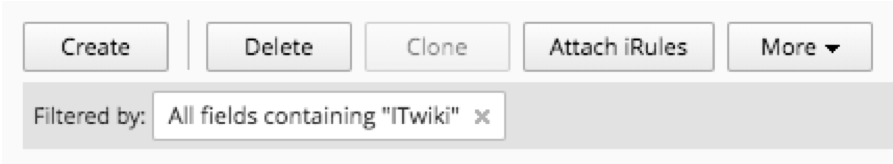
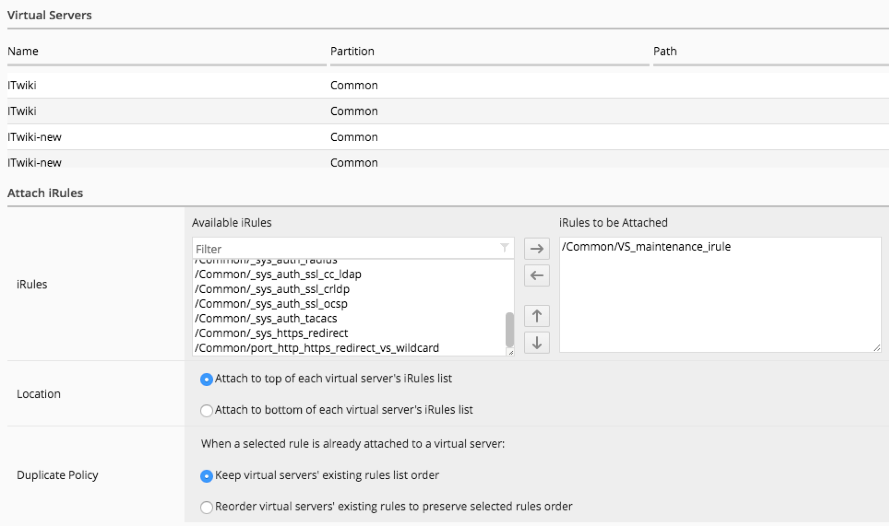

Lab 3.2: Create iRule and attach to multiple VS
-----------------------------------------------

BIG-IQ allows users to create iRules and use them on the virtual servers that are managed by BIG-IQ. The iRules can be attached to individual virtual servers or iRules can be attached to multiple virtual servers in the same operation.

In this scenario, we will apply an iRule to a number of our virtual servers that presents a maintenance page if none of the pool members supporting the virtual are online and available.

1. Steps 1-5 show that you can create an iRule on the BIG-IQ directly.
To save time the *VS_maintenance_irule* has already been created on the BIG-IQ.

2. Navigate to the Configuration tab on the top menu bar.

3. Select **LOCAL TRAFFIC > iRules**

4. Click the Create button under iRules

5. Fill out the iRule Properties page

- Name: VS_maintenance_irule
- Partition: Common
- Body: paste from https://devcentral.f5.com/codeshare/ltm-maintenance-page-lite

.. literalinclude:: vs_maintenance_irule.tcl
  :linenos:
  :language: bash

6. Navigate to **LOCAL TRAFFIC > Virtual Servers**

7. Type *ITwiki* in the filter box on the right hand side of the screen and press return

8. Click to select all the matching virtual servers

9. Click the Attach iRules button at the top of the screen

10. Fill out the Attach iRules section

- iRules: Select the **VS_maintenance_irule** iRule

11. Click Save & Close in the lower right
