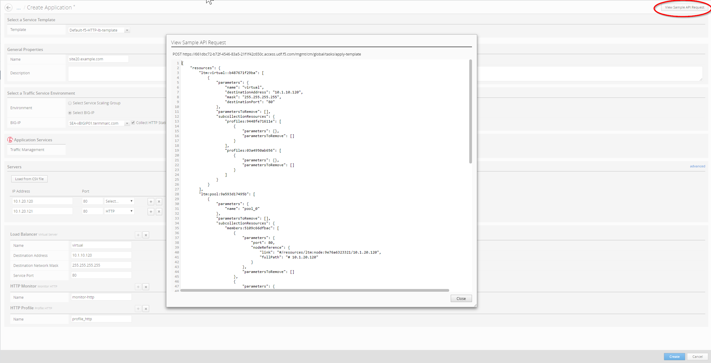
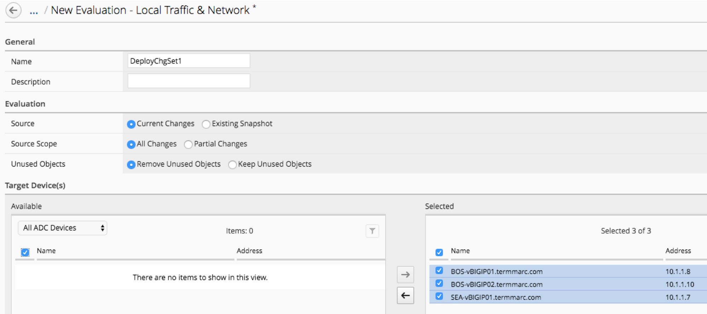
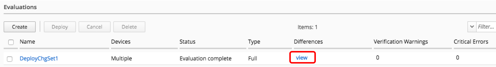
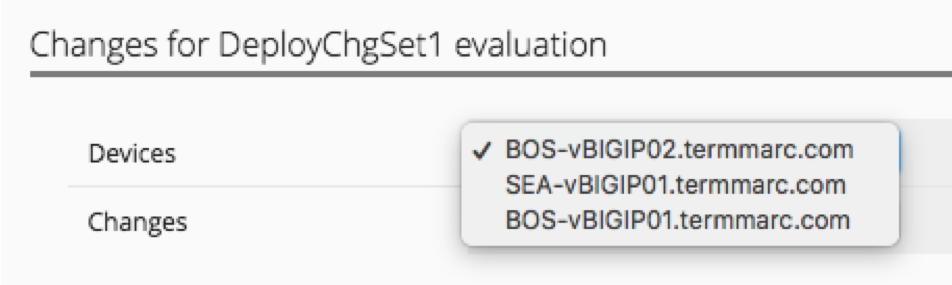
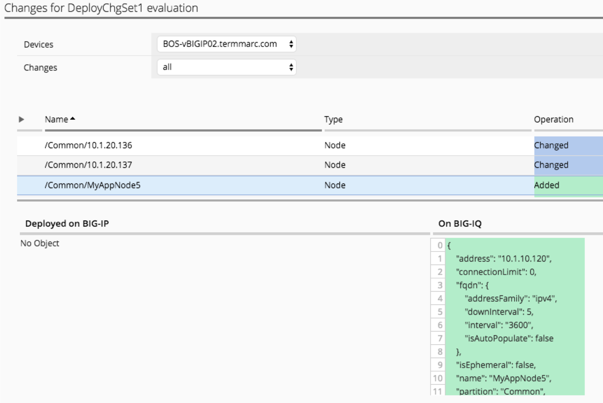
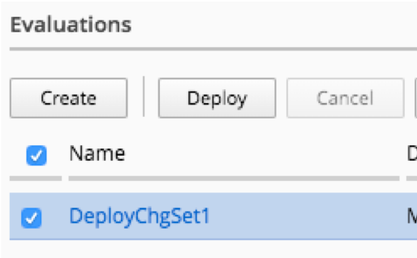
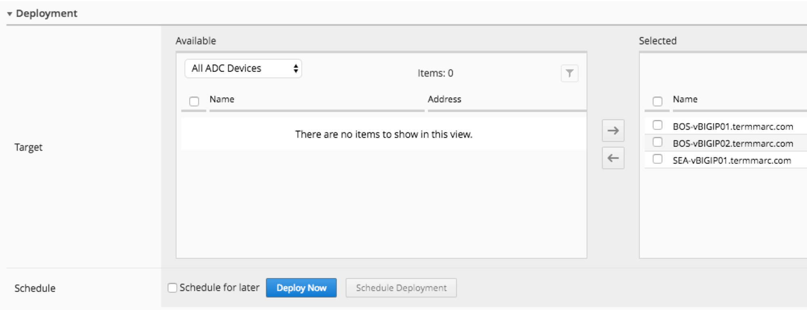
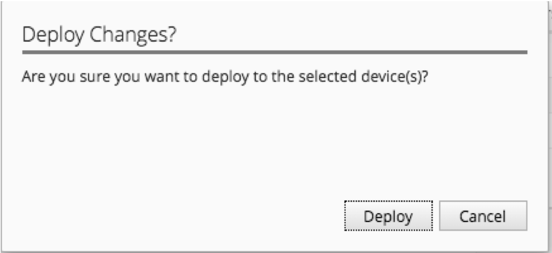
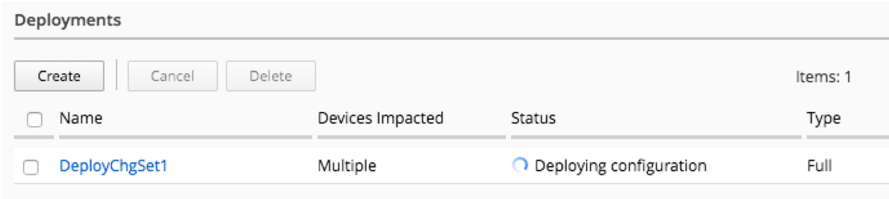
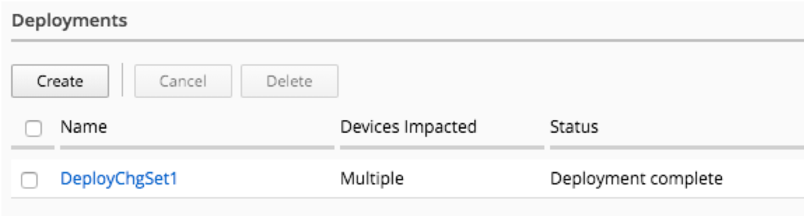

Lab 3.3: Deploy Staged changes
------------------------------

Now that we have staged a number of changes on the BIG-IQ, we will evaluate the staged changes, and then deploy them to the BIG-IPs.

1. Navigate to the Deployment tab on the top menu bar

2. Navigate to **EVALUATE & DEPLOY > Local Traffic & Network**

3. Click the Create button under Evaluations

4. Fill out the fields to Create Evaluation

- Name: DeployChgSet1
- Source: Current Changes
- Source Scope: All Changes
- Unused Objects: Removed Unused Objects
- Target: Select Group “All ADC Devices” and move all devices to Selected

5. Click the Create button in the lower right

6. After the evaluation completes, click the View link under Differences to review the changes that will be deployed

7. Review the staged changes for each device. Change devices with the selector in the upper left

Click on each change to review the differences

8. After you have reviewed all of the changes, click the Cancel button in the lower right

9. Click on the name of the Evaluation to review the options available there

10. You can review the changes to be deployed on a device by device basis and you can choose to exclude a device from the deployment at this point. At the bottom of the page, you can schedule the deployment for a later time, or you can Deploy Now. Click the Deploy Now button to push the changes to the BIG-IPs.

11. Click the Deploy button

12. At the bottom of the screen, you can review that your changes are being deployed

13. Click on the name of the Deployment to review what was deployed

14. Log in to BOS—vBIGIP01 using the TMUI and confirm that your deployment was successful. You should now see the MyAppVS5 on the Network Map.
