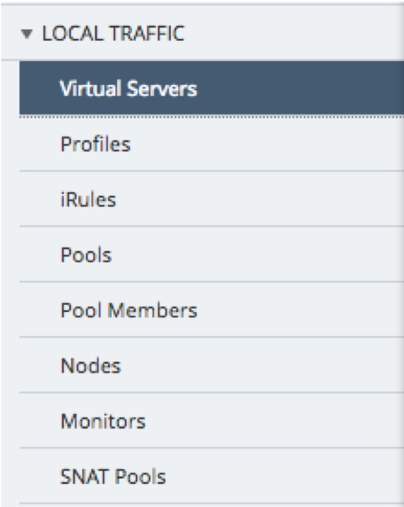
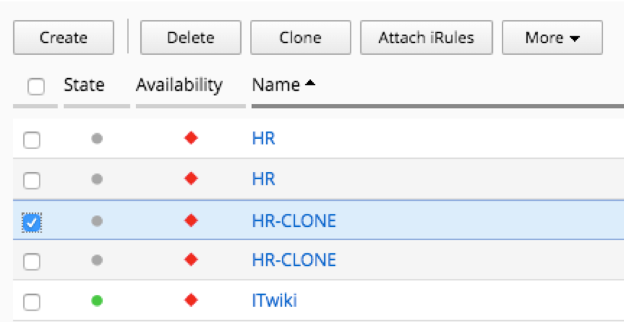
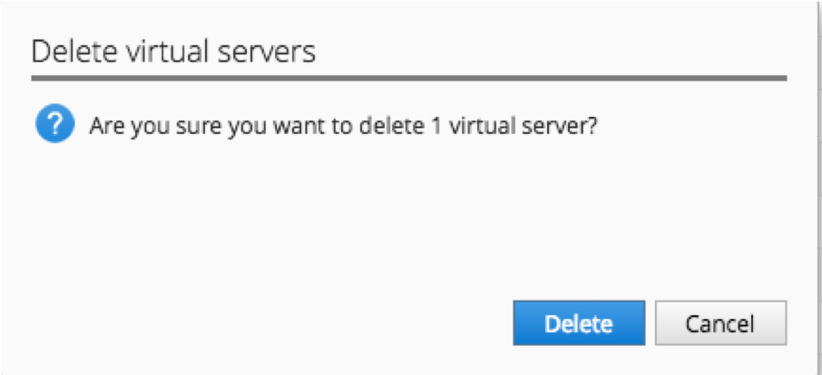
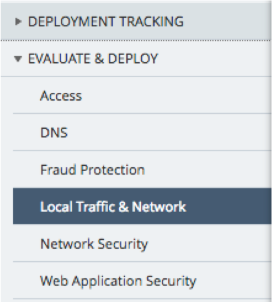
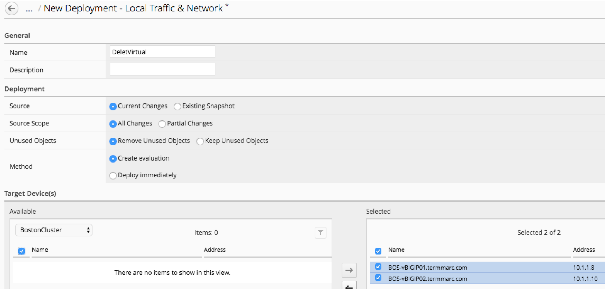
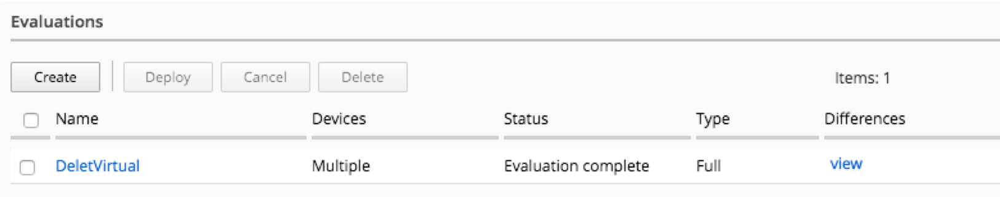
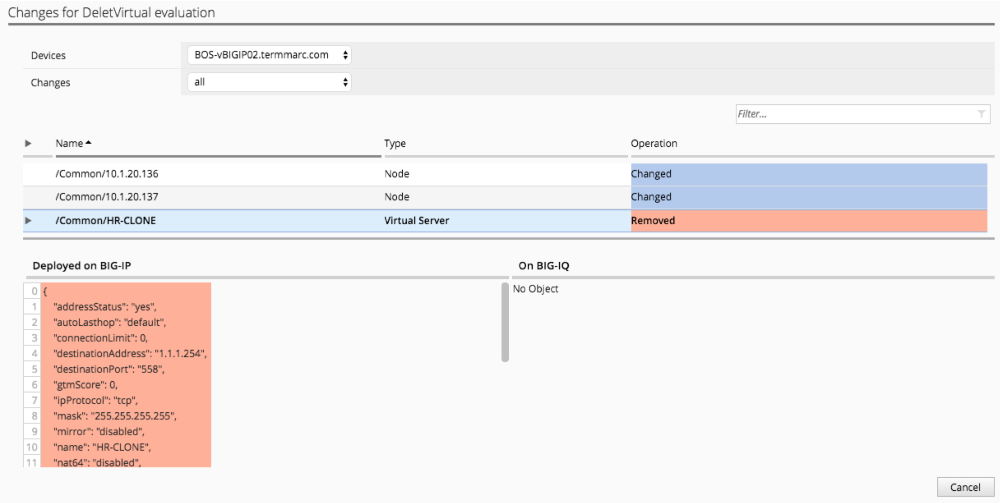
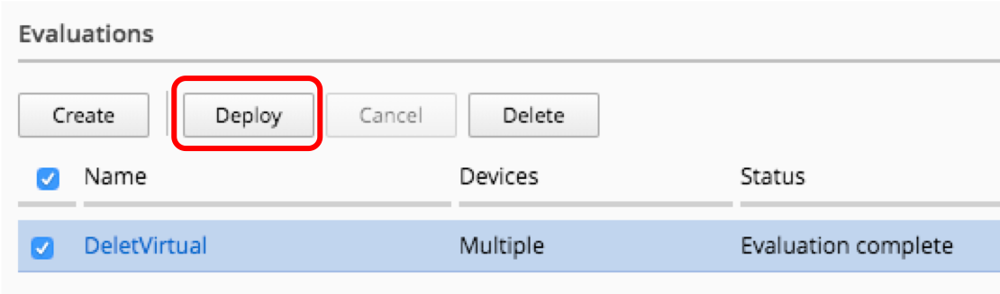
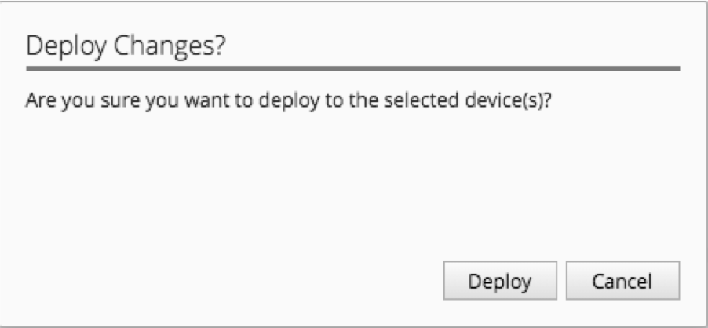

Lab 3.4: Decommission a virtual server
--------------------------------------

BIG-IQ can be used to remove virtual servers, and other objects that are no longer needed. The same staged change workflow applies for removal of objects.

1. Navigate to the **Configuration** tab on the top menu bar

2. Navigate to **LOCAL TRAFFIC > Virtual Servers**

3. Select the top HR-CLONE virtual server

4. Click the Delete button

5. Verify that you want to delete this virtual server from the BIG-IQ configuration

6. Now we need to deploy this change. Navigate to the Deployment menu on the top menu bar

7. Navigate to **EVALUATE & DEPLOY > Local Traffic & Network**

8. Click the Create button under Deployments

  .. image:: ../pictures/module3/img_module3_lab4_5.png
    :align: center
    :scale: 50%

9. Fill out the evaluation properties

- Name: DeleteVirtual
- Source: Current Changes
- Source Scope: All Changes
- Unused Objects: Remove Unused Objects Method: Create Evaluation
- Target: Group, BostonCluster, both devices selected

10. Click the create button in the lower right

11. After the evaluation completes, review the differences by clicking the view link under Differences

12. Review the differences

13. After you have reviewed all of the changes, click the Cancel button in the lower right

14. Click the Deploy button to push the changes to the BIG-IPs

15. Verify that you want to deploy the changes to the selected devices

Once complete, you can connect to any of the BOS BIG-IP device and check that *HR-CLONE* virtual server has been deleted.
