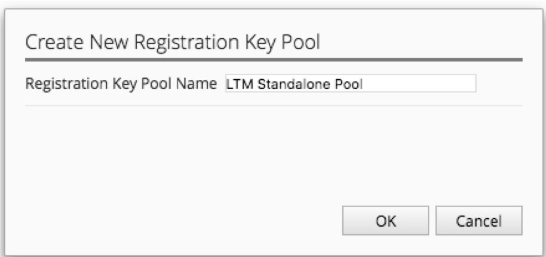
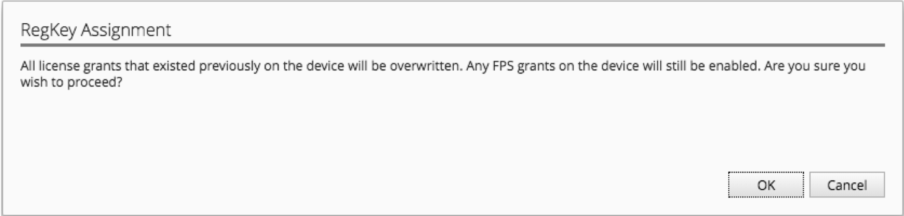

Lab 4.1: Using BIG-IQ as a license server for BIG-IP VE
-------------------------------------------------------

BIG-IQ has the ability to act as a license server for BIG-IP VE devices. Using Registration Keys, this function allows customers to move VE keys from one device to another without having to contact F5 support to have the allow-move flag set.

Prior to versions 5.1, customers could purchase pools of license keys from F5 managed by BIG-IQ.
Version 5.1 introduced the ability for customers to create their own pool of registration keys from keys that they already own or new keys they have purchased.

This workflow demonstrates the pool based licensing capabilities:

- The ability to import single VE registration keys
- The steps to allocate these keys to BIG-IP devices
- The ability to report on the license usage

1. First, we must generate some registration keys for use in this workflow

In order to same time, we already generated those keys for you :)
You will find the licenses in **NEED TO CHECK LICENSES**

2. Navigate to **LICENSE MANAGEMENT > Licenses** under the Device tab. (Represents device operations)

3. Click *Add License*

4. Fill in the form for your purchased license pool (VEP)

5. Click Activate in the lower right

6. Click Accept in the lower right to accept the EULA

7. Repeat steps 6-8 for the Volume license pool (VLS)

.. image:: ../pictures/module4/img_module4_lab1_4.png
  :align: center
  :scale: 50%

8. While the Volume Pool is activating, click on the pool name to see the activation of all of the offering types for the pool

.. image:: ../pictures/module4/img_module4_lab1_5.png
  :align: center
  :scale: 50%

.. image:: ../pictures/module4/img_module4_lab1_6.png
  :align: center
  :scale: 50%

.. note:: This pool will not be active until all of the offerings complete activation. In Ravello, you will need to manually activate all the licenses due to the fact there is no access to the license server.

9. Click the arrow at the top of the pool properties screen to add the next pool

.. image:: ../pictures/module4/img_module4_lab1_7.png
  :align: center
  :scale: 50%

10. Repeat steps 6-8 for the Utility license pool (MSP)

.. image:: ../pictures/module4/img_module4_lab1_8.png
  :align: center
  :scale: 50%

.. note:: Utility pools activate offerings, just like the Volume pools, so the same holds true that the pool will not be active until the offerings are activated

11. Now, we will create a new pool to hold our LTM standalone keys. Click the New RegKey Pool button

12. Fill out the pool properties

13. Click the Add RegKey button to add your first LTM standalone key

14. Add the first LTM key to the pool

15. Click Activate in the lower right

16. Click Accept in the lower right to accept the EULA

17. Repeat step 14-16 for your second LTM regkey

18. Click Save button in the lower right to save your pool

19. You should now have a screen that looks like this

.. image:: ../pictures/module4/img_module4_lab1_13.png
  :align: center
  :scale: 50%

20. Now that we have all these different key types available in BIG-IQ, we will use BIG-IQ to push a license to a device

21. We will start by granting one of our LTM standalone keys. Click on the name of the pool

22. Select the license that you want to assign to a device and click the Assign button

23. You can assign the licenses to managed devices or unmanaged devices from BIG-IQ

For this lab, we will use PAR-vBIGIP01 as an unmanaged device.

- Select *Unmanaged Device*
- IP Address: 10.1.1.15
- Username: admin
- Password: admin

24. Click the Assign button in the lower right

25. Click the OK button to proceed with the assignment of the license

26. You should now see that license as assigned out of the pool

27. You can also view all assignments by clicking on Assignments in the left hand menu

28. From the Assignments page, you can change the license that is assigned to a device. To do this, select the assignment that you wish to change and click on the Change License button

29. Let us change the license to something from our Utility pool, so we can explore the different settings that are required for a license with Offerings and a Unit of Measure. Fill out the New Assignment section with the following information

- Username: admin (NOTE: this is not required if the device is managed by BIG-IQ)
- Password: admin (NOTE: this is not required if the device is managed by BIG-IQ)
- License Type: Utility
- Name: byol-pool-utility
- Offering: F5-BIG-MSP-BT-1G-LIC-DEV
- Unit of Measure: Monthly

30. Click the Assign button in the lower right

31. Confirm the assignment and click the OK button

32. Note the Assignments page shows the updated assignment

33. Now we can create a report that shows our license usage. Click the Report button below Assignments

34. We will generate a Historical Report that shows the license assignments that we have done today.

- Select Type: Historical Report
- Licenses: All License Types (Move all license pools from available to Selected
- Usage period: Leave Starting Date and Ending Date as today’s date

35. Click Download in the lower right hand corner to download the reports

36. If your browser raises a question about downloading multiple files, click Allow

37. Review the CSV files that are downloaded

38. Return to the Licenses screen

39. Click on the LTM Standalone pool

.. image::  ../pictures/module4/img_module4_lab1_28.png
    :align: center
    :scale: 50%

40. Observe that the license that we initially assigned was returned to the pool and could be assigned to another device
