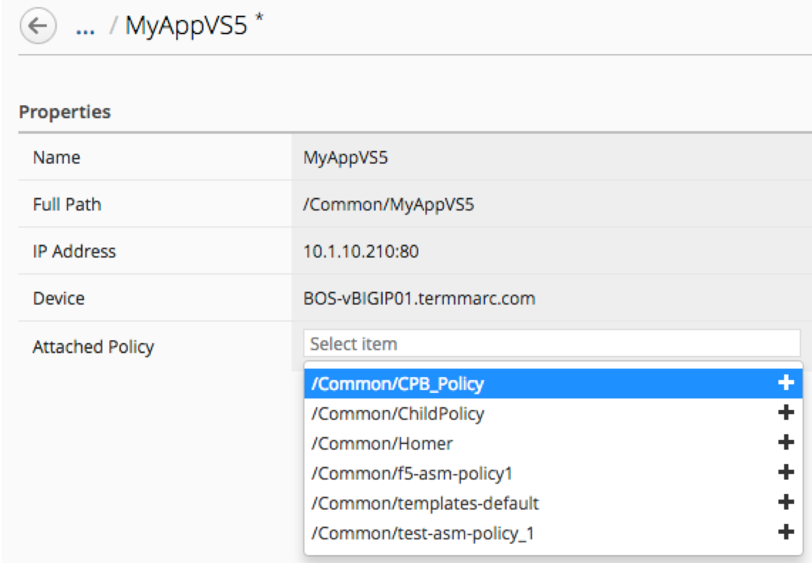

Lab 5.1: Create and deploy centralized Application Security policies
--------------------------------------------------------------------

.. note:: Make sure all the services are activated in your DCD

1. Log in to the BIG-IQ system with username (admin) and password (admin)

2. At the top of the screen, select Configuration from BIG-IQ menu

3. Expand the Security Column, then expand Web Application Security and then choose Policies

.. image:: ../pictures/module5/img_module5_lab1_1.png
  :align: center
  :scale: 50%

4. Select the policy named "templates-default" and click on "More / Clone".

**SCREENSHOT**

- Name the new policy "CPB_Policy"

**SCREENSHOT**

5. Click on *CPB_Policy* policy to open its parameters

- Expand the Policy Building section and click on *Settings*. Note the defaults and make sure to change "Auto-Deploy Policy" to **Disabled**.

.. image:: ../pictures/module5/img_module5_lab1_2.png
  :align: center
  :scale: 50%

- Note that *Policy Building Mode* is defined to *Central*, it means that BIG-IP will send all the suggestions done by policy builder to BIG-IQ through BIG-IQ DCD component (Policy Building Device entry)

6. Now we will assign that new policy to the previously created Virtual Server.

- Go to ** SECURITY -> Web Application Security / Virtual Servers**

**SCREENSHOT**

- Click on **MyAppVS5** from *BOS-vBIGIP01*

**SCREENSHOT**

- In *Attached Policy*, choose "CPB_Policy" from the dropdown list

**SCREENSHOT**

- Click "Save & Close"

7. Select both *"MyAppVS5"* from BOS-vBIGIP01 and BOS-vBIGIP02 and click *Deploy*

**SCREENSHOT**

8. Name the new deployment as **Deploy WAF Policy**

9. At the bottom left of the menu you will see a Target Devices section, choose Find Relevant Devices

10. Move *BOS-vBIGIP01* and *BOS-vBIGIP02* in the *Selected* box and click **Create**

11. Note the evaluation process, when complete click on view to note the policy differences

.. image:: ../pictures/module5/img_module5_lab1_10.png
  :align: center
  :scale: 50%

12. Note the view of the "Diff"

.. image:: ../pictures/module5/img_module5_lab1_12.png
  :align: center
  :scale: 50%

13. Click **Cancel** to return to the Evaluate and Deploy menu

14. Deploy the changes. Choose the **Deploy Now** option and confirm

15. Validate successful completion by confirming that status is “Deployment Complete”

16. Log in to the BIG-IP BOS-vBIGIP01 (TMUI) with username (admin) and password (admin)

17. Expand the security tab and choose *Application Security -> Policy Building -> Traffic Learning*

- Note the status of Traffic Learning for policy *CPB_Policy*

.. image:: ../pictures/module5/img_module5_lab1_3.png
  :align: center
  :scale: 50%

18. Launch a SSH session to Ubuntu Lamp Server using your local SSH client and launch the following command:

- *# /home/f5/scripts/generate_bad_vs5.sh"
- Leave the script running in the background

19. Return to the BIG-IQ UI and navigate to Policy Building Suggestions of policy "CPB_Policy"

- You should see some suggestions appearing
- Look for a learned action "Delete File Type" with violation 'illegal file type' with entity value *'exe'*
- Click on it
- This will bring up a detailed suggestion menu. Choose Accept in the *Actions* button and confirm

20. Go back to *Policies -> CPB_Policy* - choose Deploy in the *More* button

21. Name the new deployment as **Deploy-WAF-suggestions** and deploy it immediatly without an evaluation

22. At the bottom left of the menu you will see a Target Devices section, choose Find Relevant Devices

23. Move both BOS BIGIP in the *Selected* box and click **Create**

24. Validate successful completion by confirming that status is “Deployment Complete”

