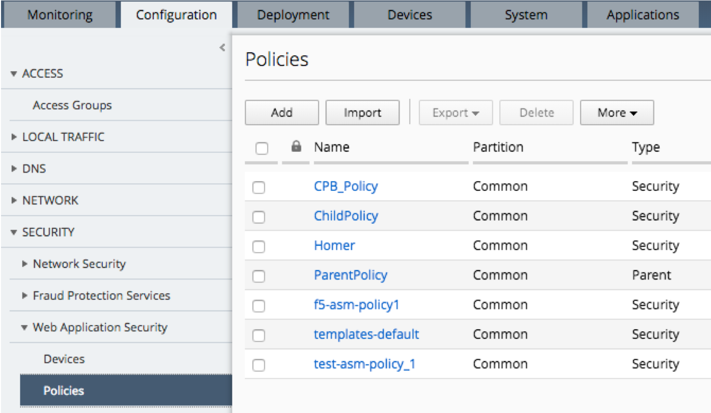

Lab 5.1: Create and deploy centralized Application Security policies
--------------------------------------------------------------------

.. note:: Make sure all the services are activated in your DCD

1. Log in to the BIG-IQ system with username (admin) and password (admin)

2. At the top of the screen, select Configuration from BIG-IQ menu

3. Expand the Security Column, then expand Web Application Security and then choose Policies

4. Click on *templates-default* policy to open its parameters

- Expand the Policy Building tab and click on settings. Note the defaults

.. image:: ../pictures/module5/img_module5_lab1_2.png
  :align: center
  :scale: 50%

- Note that *Policy Building Mode* is defined to *Central*, it means that BIG-IP will send all the suggestions done by policy builder to BIG-IQ through BIG-IQ DCD component (Policy Building Device entry)

5. Log in to the BIG-IP SEA-vBIGIP01 (TMUI) with username (admin) and password (admin)

6. Expand the security tab and choose *Application Security -> Policy Building -> Traffic Learning*

- Note the status of Traffic Learning for *templates-default*

.. image:: ../pictures/module5/img_module5_lab1_3.png
  :align: center
  :scale: 50%

8. Return to the BIG-IQ UI and navigate to Policy Building Suggestions

- Look for a learned entity similar to *Unparsed PHP directive* below
- Click on its associated *Add signature*
- This will bring up a detailed suggestion menu. Choose Accept and Stage and confirm

.. image:: ../pictures/module5/img_module5_lab1_4.png
  :align: center
  :scale: 50%

9. Notice that File Type hxr is now added to file types

.. image:: ../pictures/module5/img_module5_lab1_7.png
  :align: center
  :scale: 50%

10. Go back to *Policies -> CPB_Policy* - choose Deploy

11. Name the new deployment as **DeployCPBUpdate**

12. At the bottom left of the menu you will see a Target Devices section, choose Find Relevant Devices

.. image:: ../pictures/module5/img_module5_lab1_9.png
  :align: center
  :scale: 50%

13. Move 10.1.1.8 is the "Selected" box and click **Create**

14. Note the evaluation process, when complete click on view to note the policy differences

.. image:: ../pictures/module5/img_module5_lab1_11.png
  :align: center
  :scale: 50%

15. Note the view of the "Diff"

16. Click **Cancel** to return to the Evaluate and Deploy menu

17. Deploy the changes. Choose the **Deploy Now** option and confirm

.. image:: ../pictures/module5/img_module5_lab1_13.png
  :align: center
  :scale: 50%

18. Validate successful completion by confirming that status is “Deployment Complete”

.. image::  ../pictures/module5/img_module5_lab1_14.png
    :align: center
    :scale: 50%
